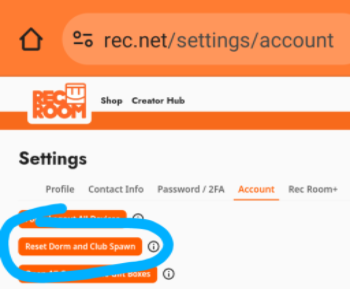

# SwiftPrinter v0.6.0

### by FaustRoland

 - Fast: Most prints are finished in an hour.
 - Cheap: 50 tokens per print (see below)

Check it yourself in room: **SwiftPrinterDemo**

Import now works only if you have resolution 1920x1080

You have to have python installed

Join [Printing discord](https://discord.gg/GuzwRMsyW8)

## Tutorial:

Go to **SwiftPrinter** room and grab all inventions from the link buttons
 - Swift Printer 0.6.1
 - Swift Printer Data 0.6.0
 - 212 Markers (split to four inventions due ink limitations)
 - Swift Printer Canvas Pos (just tamplate to show where and how big the canvas should be)

Empty your Dorm
(don't use Delete All button, is bugged)

Spawn all inventions from the Preview in Store. 

Connect the Printer with the Data Table chip under it (A to A, B to B, you will figure the rest). 

Connect the Printer with the execute pins on input and output.

[Fig.3 Image of connected pins]

Save and reload/reset the room. It seats you properly.

Note: Once you import all colors it switches you to importing data. Once the print finishes, the seat will switch back to color importing.

If you want to go back down to color import manually. Send Test Event with parameter "down" (or if zou want to go up to tables, send parameter "up")

[Fig.4 Image of Send Test Event with parameter down]

Data Generation Website: https://toucan-flowing-jennet.ngrok-free.app/ 

(Once I get some money from this project back, I'll buy a proper domain 🙂 )

Do not use it when you see there LOAD 100% (wait a minute and reload the page)

(Use only PNG, roughly 1024x1440)

Download import script from here - Click green Code button on the up left and click Download Zip.

[Fig.5 Download Zip]

Unzip

Place the image.png.zip (dont unzip) to the same folder.

Run the import.py and switch to RecRoom

You can specify from which marker you want to start in case some catastrophic import failure (212 markers is quite a lot to start over)

The script import the colors first and then imports the data as well automatically.

Or at least try. There is an ongoing issue with the Data Tables causing to lag/crash the game if there is too much data pasted into the table.

If you encounter such behaviour, try to lower the size of entered data. Open settings.txt and change the "data_chunk_size". The default value is 100000, if I run into troubles, I set it to half (50000).

Once the data is entered, the script attempts to start printing. If its canvas, keep the script open, it will save the room once the print finishes.

If you run into troubles with Data Table Import, you can run onlyTables.py which imports only data and you may specify from which table ou want to start.

If everything fails, there is a manualTables.py which exports the image_data into separate files, so you can import it manually.

### Canvas print: 

Spawn "Swift Printer Canvas Pos" and make your canvas roughly same size. (It's outside the dorm), then you can delete it.

### T-shirt print:

You need to set the board correctly

You need to set SHIRT pin to TRUE and set FRONT, BACK according where on the shirt you want to print.

https://youtu.be/kOr8Plvj5mE?si=O1XNpNfCO4iU8oga

### Price: 

50 tokens per print (kind of*)

Currently free in the "beta" until I get rid of bugs. (You can still buy the license as a donation)

Printer requires a license key to start printing, but keeps printing when the license expires during the print. 

Go to **SwiftPrinter** room to generate your license.

You can use RR tokens or Swift Tokens (currently obtainable by hanging out in the room, but planning fun activities to get them)
The licence room can host only one person, but there is a "hangout area" where you can invite friends if you want to chat/chill and collect Swift Tokens.

*The license is bound to your account and is valid for an hour/day/week/month. So it's up to you how many images are you able to start printing within an hour.

## TODO: Breakdown if the individual chip options
